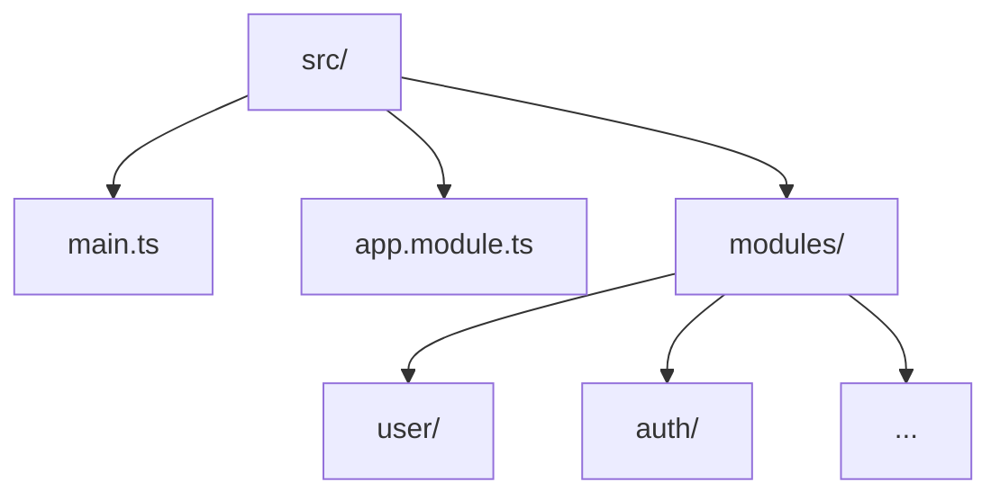

# Tổng quan về NestJS

NestJS là một framework Node.js mạnh mẽ, hiện đại, được xây dựng dựa trên TypeScript, giúp phát triển ứng dụng backend theo kiến trúc modular, dễ mở rộng và bảo trì.

## Đặc điểm nổi bật
- Sử dụng TypeScript, hỗ trợ OOP, DI, Decorator.
- Kiến trúc module rõ ràng, dễ tổ chức code.
- Tích hợp sẵn các giải pháp phổ biến: REST, GraphQL, WebSocket, Microservices.
- Hệ sinh thái plugin phong phú, dễ mở rộng.
- Tương thích với Express, Fastify.

## Cấu trúc dự án NestJS

:::tip
NestJS tổ chức code theo kiến trúc module, giúp tách biệt chức năng và dễ mở rộng.
:::

### Sơ đồ tổng quan cấu trúc


### Vai trò các thành phần chính
| Thành phần      | Vai trò |
|-----------------|--------|
| main.ts         | Điểm khởi tạo ứng dụng, bootstrap module gốc |
| app.module.ts   | Module gốc, import các module con |
| modules/        | Chứa các module chức năng (user, auth, ...) |
| user/           | Quản lý logic người dùng |
| auth/           | Xử lý xác thực, phân quyền |

:::info
Mỗi module thường gồm các file: controller, service, dto, entity/model.
:::

### Ví dụ cấu trúc thư mục chi tiết
```text
src/
  main.ts
  app.module.ts
  modules/
    user/
      user.controller.ts
      user.service.ts
      user.module.ts
      dto/
      entity/
    auth/
      auth.controller.ts
      auth.service.ts
      auth.module.ts
      dto/
      entity/
```

## Ứng dụng thực tế
- Xây dựng API backend cho web/mobile.
- Hệ thống microservices, real-time, IoT.
- Dự án lớn cần tổ chức code rõ ràng, dễ mở rộng.

## Tài liệu tham khảo
- [NestJS Docs](https://docs.nestjs.com/)
- [Github NestJS](https://github.com/nestjs/nest)
